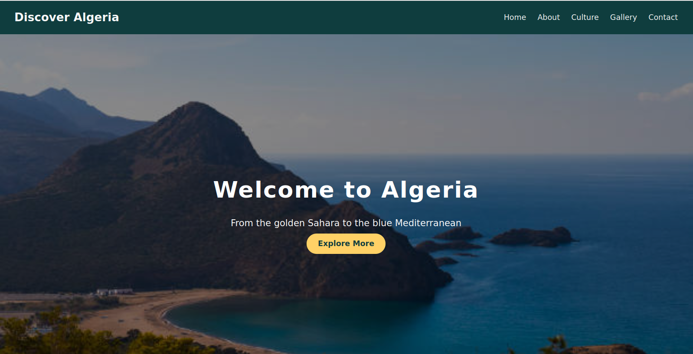
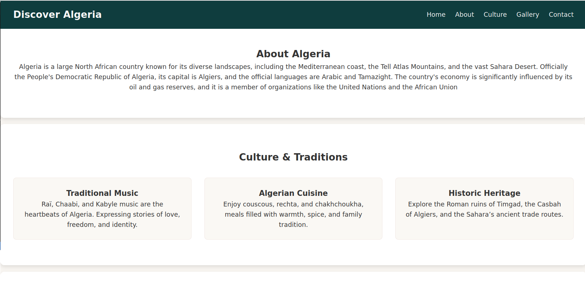
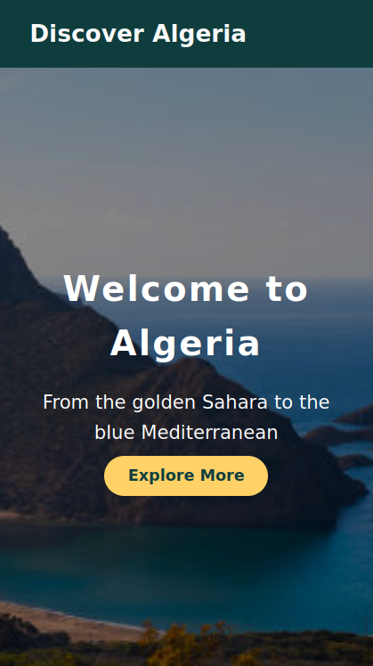
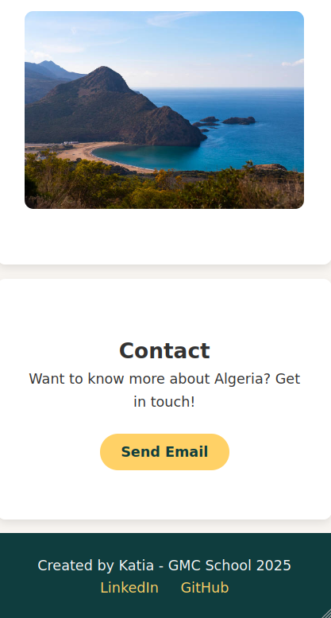

# Discover Algeria — Mini Website

Welcome to **Discover Algeria**, a creative and responsive mini website built entirely with **HTML** and **CSS**.

---

## About the Project

This website highlights the beauty, culture, and history of **Algeria**, my chosen country.

---

## Features

- **Clean HTML structure** — organized and semantic
- **Modern CSS styling** — colors and fonts managed through CSS variables (`:root`)
- **Fully responsive** — works perfectly on both phone and computer
- **Beautiful hover effects & transitions** — for a dynamic look
- **Creative sections** — Hero, About, Culture & Food, Gallery, and Footer

---

## Screenshots

